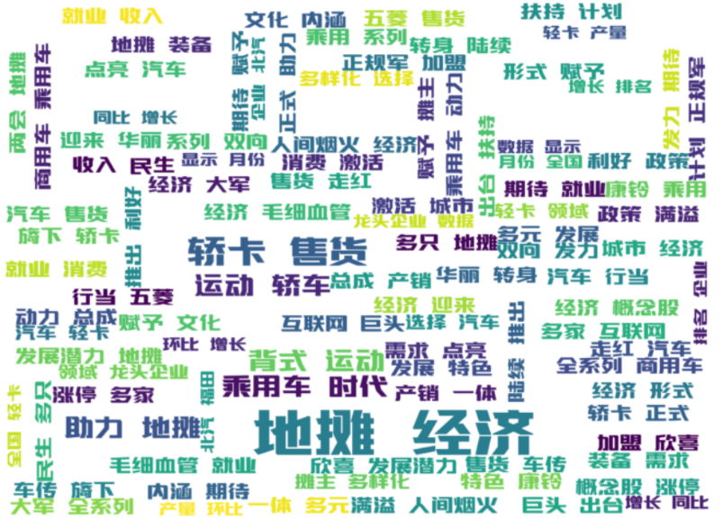
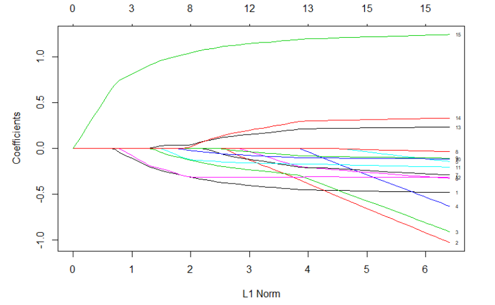

@[TOC]

### Research Objectives

This research mainly focuses on *Mining Potential Customers and Analyzing Traits For Street Stall Economy*. After the pandemic COVID-19, most large and medium-sized real economies have suffered severe setbacks, and their revenues greatly reduced. At the same time, because of the virus' superior infectious ability, most residents were required to be in quarantine at home. 

Nevertheless, in the post-COVID-19 era, after several months of isolation, residents walk out of their houses with their long-repressed social desire. And they also need some kind of stimulus to reignite consumption. Stall economy can be such a stimulus, for its convenience both for customers and vendors. Stall vendors only need a car for transporting and displaying goods, and interested stall customers will grab something when passing by. Many residents always choose to take a walk after meal, go to large shopping centers and markets. Stall vendors see this phenomenon as an opportunity, and provide relatively cheap commodities to attract customers.

However, problems still exist. The competition between the protection of city environment and economy development becomes extremely obvious under the stall economy situation. After Beijing relaxed rules and allowed more vendors to set up on the road, on the square, many citizens complained that the environment is ruined, and vendors' forgetting to clean up the garbages had caused lots of unconvenience. Besides this, for many novices and specultors who want to start their own stalls, the choice of a suitable good to sell is hard to make. Even if they have chosen the suitable product, they will still have problems with their target crowd. Also, street-stall economy, which is full of unlicensed hawkers, is always characterized by disorder, filth and shoddy goods. The image needs to be rehabilitated, so that street vendors can be embraced, and their existence can be reboosted.

To solve these problems, we performed this investigation. The research object is Wuhan citizens. Because of the COVID-19, we cannot perform our supposed sampling procedure, which is a regret. This investigation will dive into the analysis of factors influencing citizens' choices of buying products, and clustering methods will be used to group these potential customers. We hope that this project can provide some advice for you.

### Hot-button Issues Analysis Based on Text Mining

By crawling online reports on Stall Economy, we want to know, what is the hot-button issues that residents and governments care about. During our investigation, we discover that Xinhua.net has a dynamic composition, which is suitable for crawling. We crawled around 1000 reports on Xinhua.net about Street Market Economy, ranging from February 2018 to June 2020. 

#### Word Cloud Analysis

We used `Jieba` in `Python` for analysis. `Jieba` is a chinese-oriented word segmental tool. By counting the word frequency, `Jieba` can predict the phrase and the context that the word belongs to. 

The result is shown below.

We can see from the word cloud that, *Street Stall Economy*/*Employment*/*cars*/*boost*/*generation*/*Internet*/*Concept Stock* is what people most cared about. This reveals that, the development of Stall economy is not development in 'an' industry, but developments from all industries. Except for this, words like *Employment* reveal that, encouraging street stall economy can provide lots of job opportunities for the society, and also a relatively convenient employment platform for young people who are out of work.

#### Sentimental Analysis

Using the chinese-oriented natural language processing package, `snownlp`, we can perform sentimental analysis easily according to the reports we crawled from Xinhua.net. The sentimental analysis algorithm used in `snownlp` is based on Bayesian Inference. Compared to traditional sentimental analysis algos, this approach will provide more accurate results.

According to our analysis results, the pollarity of sentimental score distribution is obvious. most reports are postive on the topic(around 90%), but there are still some reports show negative attitudes towards this topic(around 5%). The average sentimental score of reports is 0.75, which means that, the general evaluation is postive. But as it shows before, some negative feedbacks still exist.

#### Topic Extraction Based on Topic Modeling

We use Topic Modeling to mine the latent topics behind all these news reports. This Topic Modeling algorithm will extract $n$ topics from all provided texts($n$ can be defined). Those topics contain several keywords, helping define the meaning of these topics. The topics extracted are as below:

|Topic 1|Topic 2| Topic 3|Topic 4|Topic 5|
|----|----|----|----|----|
|Citizen|Policy|Area|Regulations|Products|
|Support|Sell|Stall|Control|Provide|
|Temporary|Set up stalls|Set up stalls|Temporary|Company|
|Stall|Temporary|Vendors|Sellers|Support|
|Provide|Provide|Place|Citizens|New|
|Shops|Vendors|Medium|Provide|Place|

According the key words, we define the 5 topics as:
- Topic 1: Residents' Positive Attitude towards Street Stall Economy
- Topic 2: Governments' Attitude towards Street Stall Economy
- Topic 3: Media's Attitude towards Stall's Location Problems
- Topic 4: Media's Attitude towards Regulations on Stall Economy
- Topic 5: People's Attitude towards Products Provided on Stalls

### Analysis of Factors Affecting Customer Purchase Based on Lasso-Logistic Model

During our field investigation, because of COVID-19 regulations, we cannot perform stratified sampling as we had wished to. After checking the literatures on controlling sampling error in online investigation, we decided to use *Central Intercept Test(CIT)* combined with online investigation instead. We collected 814 samples in our investigation.

After we implemented sampling and field investigation, we cleaned the data and chose respondents' personal information, like their gender, age, education history as independent variables, and whether they would like to shop in stalls(Yes for 1; No for 0) as dependent variable. Independent variables we chose are *Gender(Sex),  Age(Age_18,Age18_30, Age31_50), Education Level(Edu_1 to Edu_4), Location(Urb), Family Size(mem), Income(Inc), Knowledge of Relevent Policies(Pol)*.

All variables are Dummy Variables.

The model is set as:
$$
y_i = \beta_0 + \beta_1 male+\beta_2 age_18+\beta_3 age_{18\sim30}+\beta_4 age_{31\sim50}\\
+\beta_5 edu_1+\beta_6 edu_2 +\beta_7 edu_3 +\beta_8 edu_4+\beta_9 urb+\beta_{10}mem\\
+\beta_{11}inc_{10}+\beta_{12}inc_{10\sim20}+\beta_{13} inc_{20\sim30}\\
+\beta_{14}inc_{30\sim 40}+\beta_{15}pol
$$

Using $\log(\lambda)$ to decide the suitable numbers of variables. The result is 6. 

The Lasso Solution diagram is shown as above.

According to this figure, we chose the 6 variables as: $sex, age_{18\sim 30}, inc_1, inc_2, inc_3,Pol$. Again, we perform Logistic Regression on these variables, and get the coefficients as below.

|Variable|Coefficient|OR|
|----|----|----|
|(Intercept)|0.873|2.395|
|Sex|-0.260|0.771|
|Age18_30|-0.657|0.936|
|Inc_10|-0.027|0.974|
|Inc10_20|-0.243|0.784|
|Inc20_30|0.033|1.033|
|Pol|0.980|2.663|

#### Model Result Analysis
- **Gender:** The coefficient appears to be negative. According the the $OR$ value, male's possibility in buying stall products is 77.1% more than woman.
- **Age:** Only $Age18\_30$ is chosen buy the $LASSO$ model, which means that there is no definite corelation between age and customers' willingness in buying stall products. This only means that, customers aging from 18 to 30 is just a little less willing to shop at street stalls, than people who are over 50.
- **Education Level:**  There is no obvious difference in people's willingness to shop in stalls concerning their education level.
- **Income:** Set the benchmark as people whose incomes are more than 400,000. For $Inc_{10}$, the coefficient is negative, which means that people whose incomes are below 200,00, will be less likely to shop at stalls than people with higher wages. The coef of $Income_{20\sim 30}$ is positive, wich means that peopel whose annual pay ranging from 200,000 to 300,000 are more likely to shop at street stalls. This phenomenon shows taht, the increase in people's willingness in shopping at stalls will not be in line with their revenue growth. However, this does not mean that, people with higher income will be more willing to go to stalls. One possible explanation is that, people with extremely high or low income will probably not be the target customers of street stalls. However, those with lower middle and middle level incomes will be more likely to shop at stalls.
- **Policy:** Research result shows that, the variable *pol* proves to be most significant in all variables. From the perspective of coefficients, the possibility for people who have heard of *China's Street Stall Economy Policy* to shop in stalls is 166.32% larger than who have not. 

### Potential Customer Mining Based on Clustering Methods

### Results

### Download Our Report Here!

